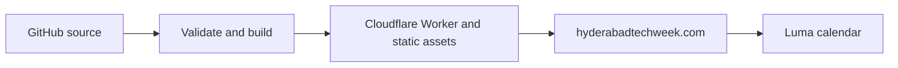

# Hyderabad Tech Week

[Hyderabad Tech Week](https://hyderabadtechweek.com) is a citywide builder week taking shape for founders, engineers, designers, investors, operators, and community hosts across Hyderabad.

The public website is intentionally simple while the program is being prepared. Follow the Luma calendar to get notified when updates open.

[Get notified on Luma](https://lu.ma/hyderabadtechweek)

## Media Kit

Official logos, usage notes, colors, and typography are available at
[hyderabadtechweek.com/media-kit](https://hyderabadtechweek.com/media-kit/).

## What To Expect

- Community-hosted rooms across Hyderabad.
- Founder conversations, technical sessions, demos, and meetups.
- A public calendar that makes the week easy to discover and follow.

## Links

- Website: [hyderabadtechweek.com](https://hyderabadtechweek.com)
- Media kit: [hyderabadtechweek.com/media-kit](https://hyderabadtechweek.com/media-kit/)
- Calendar: [lu.ma/hyderabadtechweek](https://lu.ma/hyderabadtechweek)
- Contact: [Yashraj Nayak](https://in.linkedin.com/in/yashrajnayak)

## Hosting and development

GitHub stores source history. Cloudflare Workers serves the website and assets; GitHub Pages is retired. The public design and calendar remain unchanged by the hosting migration.

Run `npm run validate`, then `npm run build`. Preview with `npm run serve`. Deploy the reviewed build using `npx wrangler deploy` after authenticating to the correct Cloudflare account. Deployment is manual; no automatic GitHub integration is implied.
